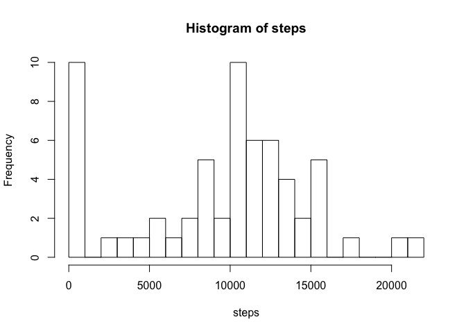
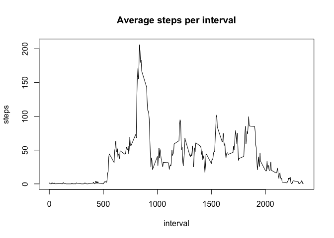
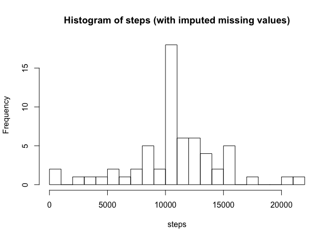
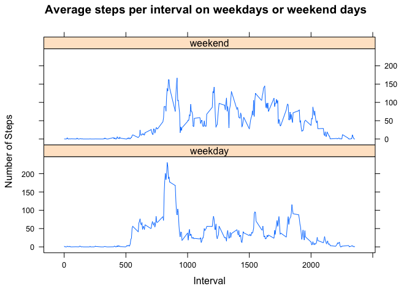

# Reproducible Research: Peer Assessment 1


## Loading and preprocessing the data

The data is unzipped, loaded, and reshaped using the melt function in the reshape2 package.


```r
library(reshape2)
unzip("activity.zip")
activity <- read.csv("activity.csv")
act <- melt(activity, id.vars=c("date", "interval"))
head(activity)
```

```
##   steps       date interval
## 1    NA 2012-10-01        0
## 2    NA 2012-10-01        5
## 3    NA 2012-10-01       10
## 4    NA 2012-10-01       15
## 5    NA 2012-10-01       20
## 6    NA 2012-10-01       25
```

```r
head(act)
```

```
##         date interval variable value
## 1 2012-10-01        0    steps    NA
## 2 2012-10-01        5    steps    NA
## 3 2012-10-01       10    steps    NA
## 4 2012-10-01       15    steps    NA
## 5 2012-10-01       20    steps    NA
## 6 2012-10-01       25    steps    NA
```

## What is mean total number of steps taken per day?

Ignoring missing values, a histogram of total number of steps taken per day is plotted:


```r
actsum <- dcast(act, date ~ variable, fun.aggregate = sum, na.rm=TRUE)
head(actsum)
```

```
##         date steps
## 1 2012-10-01     0
## 2 2012-10-02   126
## 3 2012-10-03 11352
## 4 2012-10-04 12116
## 5 2012-10-05 13294
## 6 2012-10-06 15420
```

```r
with(actsum, hist(steps, breaks=20))
```

<!-- -->

The mean and median values of the total number of steps taken per day is calculated:


```r
mean(actsum$steps)
```

```
## [1] 9354.23
```

```r
median(actsum$steps)
```

```
## [1] 10395
```

## What is the average daily activity pattern?

Still ignoring missing values, the average number of steps taken in a five-minute interval (averaged over all days) is plotted as a time series:


```r
actint <- dcast(act, interval ~ variable, fun.aggregate = mean, na.rm=TRUE)
head(actint)
```

```
##   interval     steps
## 1        0 1.7169811
## 2        5 0.3396226
## 3       10 0.1320755
## 4       15 0.1509434
## 5       20 0.0754717
## 6       25 2.0943396
```

```r
with(data=actint, plot(x=interval, y=steps, type="l", main="Average steps per interval"))
```

<!-- -->

The 5-minute interval with the maximum number of steps, averaged across all days, is found here:


```r
actint[which.max(actint$steps),]
```

```
##     interval    steps
## 104      835 206.1698
```

## Imputing missing values

The total number of missing steps values is calculated:


```r
sum(is.na(act$value))
```

```
## [1] 2304
```

To impute the missing number of steps for a given time interval, the average value of steps for that time interval (averaged over all days) is used:


```r
filled <- act
for (i in 1:length(filled$value)) {
  if (is.na(filled[i,]$value)) {
    int = filled[i,]$interval
    filled[i,]$value <- actint[actint$interval==int,]$steps
  }
}
actsum_filled <- dcast(filled, date ~ variable, fun.aggregate = sum, na.rm=TRUE)
head(actsum_filled)
```

```
##         date    steps
## 1 2012-10-01 10766.19
## 2 2012-10-02   126.00
## 3 2012-10-03 11352.00
## 4 2012-10-04 12116.00
## 5 2012-10-05 13294.00
## 6 2012-10-06 15420.00
```

The histogram for total number steps per day (with missing values imputed) is plotted and the mean and median values are calculated:


```r
with(actsum_filled, hist(steps, breaks=20, main="Histogram of steps (with imputed missing values)"))
```

<!-- -->

```r
mean(actsum_filled$steps)
```

```
## [1] 10766.19
```

```r
median(actsum_filled$steps)
```

```
## [1] 10766.19
```

Imputing values decreases the frequency of 0 values and increases the frequency of values at the peak around 10,000, as seen from a comparison of histograms.  This increases the values for mean and median as well.

## Are there differences in activity patterns between weekdays and weekends?

A new factor variable is created that indicates whether a given date is a weekday or weekend day, and the data is reshaped:


```r
filled$day <- ifelse(weekdays(as.Date(filled$date)) %in% c("Saturday", "Sunday"),
                     "weekend", "weekday")
weekdaysteps <- dcast(filled, interval ~ day, fun.aggregate = mean)
head(weekdaysteps)
```

```
##   interval    weekday     weekend
## 1        0 2.25115304 0.214622642
## 2        5 0.44528302 0.042452830
## 3       10 0.17316562 0.016509434
## 4       15 0.19790356 0.018867925
## 5       20 0.09895178 0.009433962
## 6       25 1.59035639 3.511792453
```

```r
weekdaymelt <- melt(weekdaysteps, id.vars = "interval")
head(weekdaymelt)
```

```
##   interval variable      value
## 1        0  weekday 2.25115304
## 2        5  weekday 0.44528302
## 3       10  weekday 0.17316562
## 4       15  weekday 0.19790356
## 5       20  weekday 0.09895178
## 6       25  weekday 1.59035639
```

Finally, the average number of steps taken during a given 5-minute interval, averaged over all weekend days (top) or over all weekdays (bottom) are plotted as time series plots:


```r
library(lattice)
xyplot(value~interval | variable, weekdaymelt, type="l", layout=c(1,2), xlab="Interval", ylab="Number of Steps", main="Average steps per interval on weekdays or weekend days")
```

<!-- -->

The plots demonstrate that there are different patterns on weekdays and weekends, on average.

